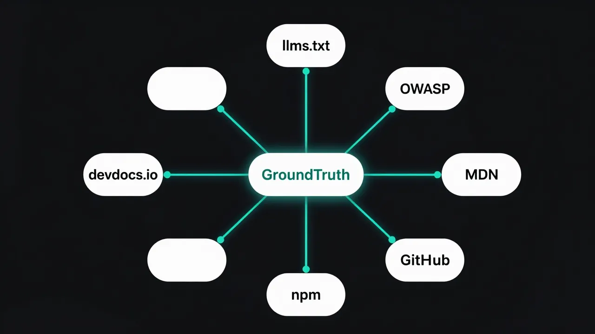

<div align="center">
<table><tr><td>
<pre>
   ██████╗ ████████╗    ███╗   ███╗  ██████╗ ██████╗
  ██╔════╝ ╚══██╔══╝    ████╗ ████║ ██╔════╝ ██╔══██╗
  ██║  ███╗   ██║       ██╔████╔██║ ██║      ██████╔╝
  ██║   ██║   ██║       ██║╚██╔╝██║ ██║      ██╔═══╝
  ╚██████╔╝   ██║       ██║ ╚═╝ ██║ ╚██████╗ ██║
</pre>
</td></tr></table>
</div>

<h3 align="center">Your AI assistant just mass-produced deprecated code again.<br/>You merged it because the formatting was clean.<br/><br/>GroundTruth fixes that.</h3>

<p align="center">
  <a href="https://www.npmjs.com/package/@groundtruth-mcp/gt-mcp"></a>
  <a href="https://github.com/rm-rf-prod/GroundTruth-MCP/actions/workflows/ci.yml"></a>
  <a href="./LICENSE"></a>
  
  
  
  
  
</p>

<h4 align="center">Self-hosted MCP server. 422+ curated libraries. 100+ audit patterns. No rate limits. No API keys.<br/>Ships updates continuously — your MCP client picks them up on restart.</h4>

---

## The problem

Your model doesn't know that React 19 killed `forwardRef`, that Next.js made `cookies()` async, or that Tailwind v4 nuked `@tailwind` directives. It writes deprecated patterns with full confidence. It hands you SQL injection dressed up as a query builder and uses `any` in TypeScript like it's a feature.

**GroundTruth runs on your machine.** Fetches docs from the source — `llms.txt`, Jina Reader, GitHub — right when you ask. 422+ curated libraries, plus npm, PyPI, crates.io, and pkg.go.dev as fallback. The audit tool reads your actual files, finds issues at exact `file:line` locations, and fetches the current fix from the real spec.

---

<p align="center">
  
</p>

---

## Install

### Claude Code

```bash
claude mcp add gt -- npx -y @groundtruth-mcp/gt-mcp@latest
```

### Cursor / Claude Desktop / VS Code

Add to your MCP config (`claude_desktop_config.json`, `.cursor/mcp.json`, or `.vscode/mcp.json`):

```json
{
  "mcpServers": {
    "gt": {
      "command": "npx",
      "args": ["-y", "@groundtruth-mcp/gt-mcp@latest"]
    }
  }
}
```

No build step. No config file. Node.js 24+. Using `@latest` means npx pulls the newest version on every session start — you always get the latest libraries, audit patterns, and fixes without doing anything.

### Optional: GitHub token

GroundTruth fetches README files, release notes, migration guides, and code examples from GitHub. Unauthenticated requests are limited to 60/hr. A token with no extra scopes takes it to 5,000/hr.

```bash
# Claude Code
claude mcp add gt -e GT_GITHUB_TOKEN=ghp_yourtoken -- npx -y @groundtruth-mcp/gt-mcp@latest

# Cursor / Claude Desktop / VS Code — add env to your config:
"env": { "GT_GITHUB_TOKEN": "ghp_yourtoken" }
```

---

## What it does

Twelve tools. Each does one thing.

| Tool | What it does |
|---|---|
| `gt_resolve_library` | Find a library by name. Falls back to npm, PyPI, crates.io, pkg.go.dev |
| `gt_get_docs` | Fetch live docs for a specific topic |
| `gt_best_practices` | Patterns, anti-patterns, and config guidance for any library |
| `gt_auto_scan` | Read your manifest, fetch best practices for every dependency |
| `gt_search` | Search OWASP, MDN, web.dev, W3C, AI provider docs, Google APIs |
| `gt_audit` | Scan source files — issues at exact `file:line` with live fixes |
| `gt_changelog` | Release notes before you upgrade |
| `gt_compat` | Browser and runtime compatibility via MDN + caniuse |
| `gt_compare` | Compare 2-3 libraries side-by-side |
| `gt_examples` | Real-world code examples from GitHub |
| `gt_migration` | Migration guides and breaking changes |
| `gt_batch_resolve` | Resolve up to 20 libraries in one call |

---

## How to use it

You don't need to memorize tool names. Just talk to your AI assistant.

```
use gt for nextjs
use gt for drizzle migrations
gt audit
use gt to check WCAG focus indicators
use gt for OpenTelemetry setup
find all issues and fix with gt
use gt for Google Gemini API
use gt for Claude tool use
```

Or call tools directly:

```typescript
gt_resolve_library({ libraryName: "nestjs" })
gt_get_docs({ libraryId: "nestjs/nest", topic: "guards" })
gt_best_practices({ libraryId: "vercel/next.js", topic: "caching" })
gt_auto_scan({ projectPath: "." })
gt_search({ query: "OWASP SQL injection prevention" })
gt_audit({ projectPath: ".", categories: ["security", "accessibility"] })
gt_changelog({ libraryId: "vercel/next.js", version: "15" })
gt_compat({ feature: "CSS container queries", environments: ["safari"] })
gt_compare({ libraries: ["prisma", "drizzle-orm"], criteria: "TypeScript support" })
gt_examples({ library: "hono", pattern: "middleware" })
```

---

## `gt_audit` — the one that finds what you missed

Walks your project, runs 107+ patterns across 18 categories, pinpoints issues at `file:line`, then fetches fix guidance from the authoritative source.

```
gt_audit({ categories: ["all"] })                      // all 18 categories
gt_audit({ categories: ["security", "node"] })         // OWASP + Node.js
gt_audit({ categories: ["python", "security"] })       // Python OWASP scan
gt_audit({ categories: ["accessibility"] })            // WCAG AA
gt_audit({ categories: ["typescript", "react"] })      // type safety + React rules
```

| Category | What it checks |
|---|---|
| `security` | XSS, SQL injection, command injection, SSRF, path traversal, hardcoded credentials, CORS wildcard |
| `accessibility` | Missing alt text, onClick on div, icon-only buttons, inputs without labels, `outline: none` |
| `react` | forwardRef (React 19), useFormState renamed, index as key, conditional hooks |
| `nextjs` | Sync cookies/headers/params (Next.js 16), Tailwind v3 directives, missing metadata |
| `typescript` | `any` type, non-null assertions, `@ts-ignore`, floating Promises |
| `performance` | Missing lazy loading, useEffect data fetching, missing Suspense boundaries |
| `layout` | CLS-causing images, 100vh on mobile, missing font-display |
| `node` | console.log in production, sync fs ops, unhandled callbacks |
| `python` | SQL injection via f-string, eval/exec, subprocess shell=True, pickle.loads |

Sample output:

```
## [CRITICAL] SQL built via template literal
Category: security | Severity: critical | Count: 2

Fix: db.query('SELECT * FROM users WHERE id = $1', [userId])

Files:
  - src/db/users.ts:47
  - src/api/search.ts:23

Live fix: OWASP SQL Injection Prevention Cheat Sheet
```

---

## `gt_auto_scan` — best practices for your whole stack

Point it at your project root. It reads the manifest, figures out what you're using, and pulls best practices for each dependency.

```
gt_auto_scan({ projectPath: "." })
```

Supports `package.json`, `requirements.txt`, `pyproject.toml`, `Cargo.toml`, `go.mod`, `pom.xml`, `build.gradle`, and `composer.json`.

---

## `gt_search` — anything that isn't a specific library

Covers security, accessibility, performance, web APIs, CSS, HTTP, AI providers, Google APIs, infrastructure, databases, and more.

```
gt_search({ query: "WCAG 2.2 focus indicators" })
gt_search({ query: "Core Web Vitals LCP optimization" })
gt_search({ query: "Claude tool use best practices" })
gt_search({ query: "Google Gemini API function calling" })
gt_search({ query: "JWT vs session cookies" })
gt_search({ query: "gRPC vs REST tradeoffs" })
```

| Area | Topics |
|---|---|
| Security | OWASP Top 10, SQL injection, XSS / CSP, CSRF, HSTS, CORS, JWT, OAuth 2.1, WebAuthn, SSRF, API security |
| Accessibility | WCAG 2.2, WAI-ARIA, keyboard navigation |
| Performance | Core Web Vitals, image optimization, web fonts, Speculation Rules |
| Web APIs | Fetch, Workers, WebSocket, WebRTC, IndexedDB, Web Crypto, Intersection Observer |
| CSS | Grid, Flexbox, Container Queries, View Transitions, Cascade Layers, :has(), Subgrid |
| AI providers | Claude, OpenAI, Gemini, Mistral, Cohere, Groq, LangChain, LlamaIndex |
| Google | Maps, Analytics, Ads, Cloud, Firebase, Vertex AI, YouTube, Gmail, Sheets |
| Infrastructure | Docker, Kubernetes, GitHub Actions, Terraform, Cloudflare Workers |

---

<p align="center">
  
</p>

## How docs are fetched

For every request, GroundTruth tries sources in order and stops at the first one that returns useful content:

1. **`llms.txt` / `llms-full.txt`** — context files published by maintainers for LLM consumption
2. **Jina Reader** — converts docs pages to clean markdown, handles JS-rendered sites
3. **GitHub README / releases** — latest release notes and README
4. **npm / PyPI / crates.io / pkg.go.dev** — fallback for packages outside the curated registry

---

## Library coverage

422+ curated entries with 100% best-practices and URL pattern coverage, plus automatic fallback to npm, PyPI, crates.io, and pkg.go.dev. Any public package in any major ecosystem is resolvable.

| Ecosystem | Libraries |
|---|---|
| React / Next.js | React, Next.js, shadcn/ui, Radix UI, Tailwind CSS, Headless UI |
| State management | Zustand, Jotai, TanStack Query, SWR, Redux Toolkit, XState |
| Backend (Node.js) | Express, Fastify, Hono, NestJS, Elysia, tRPC |
| Backend (Python) | FastAPI, Django, Flask, Pydantic |
| Backend (Go / Rust) | Gin, Fiber, GORM, Axum, Actix Web, Tokio |
| Database / ORM | Prisma, Drizzle, Kysely, TypeORM, Supabase, Neon, Turso |
| AI / LLM | Claude API, OpenAI API, Gemini API, Vercel AI SDK, LangChain, LlamaIndex |
| Testing | Vitest, Playwright, Jest, Testing Library, Cypress, MSW |
| Auth | Clerk, NextAuth, Better Auth, Lucia |
| Mobile | Expo, React Native, React Navigation, NativeWind |
| Build tools | Vite, Turbopack, SWC, Biome, ESLint, Turborepo |
| Cloud | Vercel, Cloudflare Workers, AWS SDK, Firebase, Google Cloud |
| Monitoring | Sentry, PostHog, OpenTelemetry |

Full list in the [documentation](./docs/DOCUMENTATION.md).

---

## vs. Context7

Context7 is solid. Here's why I reach for this instead.

| | GroundTruth | Context7 |
|---|---|---|
| Hosting | Self-hosted (stdio) + HTTP mode | Cloud backend, local MCP client |
| Rate limits | None | 1,000 free/month ($10/seat for 5,000) |
| Transport | Stdio + Streamable HTTP | Stdio + Streamable HTTP |
| Source priority | llms.txt -> Jina -> GitHub -> npm/PyPI | Vector DB with proprietary crawl pipeline |
| Tools | 12 specialized tools | 2 tools |
| Code audit | 107+ patterns, 18 categories, file:line, live fixes | No |
| Freeform search | OWASP, MDN, AI docs, Google APIs, web standards | Library docs only |
| Changelog, compat, compare, examples, migration | Yes | No |
| MCP Resources + Prompts | 2 resources, 8 prompts | No |
| Lockfile detection | Reads exact versions from lockfiles | No |
| Libraries | 422+ curated + npm/PyPI/crates.io/Go fallback | Undisclosed (claims "thousands") |
| API key required | No | No |

Context7 indexes docs into a vector database — fast lookups, but with indexing lag on new releases. GroundTruth fetches from the source at query time, prioritizes `llms.txt`, and scores content quality so your model knows when to retry.

---

## Environment variables

All optional. Works out of the box with zero configuration.

| Variable | Purpose | Default |
|---|---|---|
| `GT_GITHUB_TOKEN` | GitHub API auth — raises rate limit from 60 to 5,000 req/hr | none |
| `GT_CACHE_DIR` | Disk cache location for persistent cross-session caching | `~/.gt-mcp-cache` |
| `GT_CONCURRENCY` | Parallel fetch limit in `gt_auto_scan` | `6` |

---

## Contributing

The public registry lives in `src/sources/registry.ts`. Adding a library is a PR with `id`, `name`, `docsUrl`, and `llmsTxtUrl` if the project publishes one.

Issues and requests: [github.com/rm-rf-prod/GroundTruth-MCP/issues](https://github.com/rm-rf-prod/GroundTruth-MCP/issues)

---

## Active development

GroundTruth is under active development. New curated registry entries, audit patterns, search topics, and features are added regularly. The registry covers 422+ libraries with 100% bestPracticesPaths and urlPatterns coverage. Automatic fallback to npm, PyPI, crates.io, and pkg.go.dev means any public package is resolvable out of the box.

To stay updated:
- **Star and watch** the [GitHub repo](https://github.com/rm-rf-prod/GroundTruth-MCP) for release notifications
- **Use `@latest`** in your MCP config (the default install command) — npx fetches the newest version automatically
- **Check tool responses** — GroundTruth appends an update notice when a newer version is available

---

## Full documentation

Tool schemas, audit pattern details, architecture, caching internals, and the complete library list:

**[Read the full docs](./docs/DOCUMENTATION.md)**

---

## Star history

<a href="https://star-history.com/#rm-rf-prod/GroundTruth-MCP&Date">
  <picture>
    <source media="(prefers-color-scheme: dark)" srcset="https://api.star-history.com/svg?repos=rm-rf-prod/GroundTruth-MCP&type=Date&theme=dark" />
    <source media="(prefers-color-scheme: light)" srcset="https://api.star-history.com/svg?repos=rm-rf-prod/GroundTruth-MCP&type=Date" />
    
  </picture>
</a>

---

## License

[Elastic License 2.0](./LICENSE) — free to use, free to self-host, free to build on. The one thing you can't do is turn it into a managed service and sell it. Fair enough.
