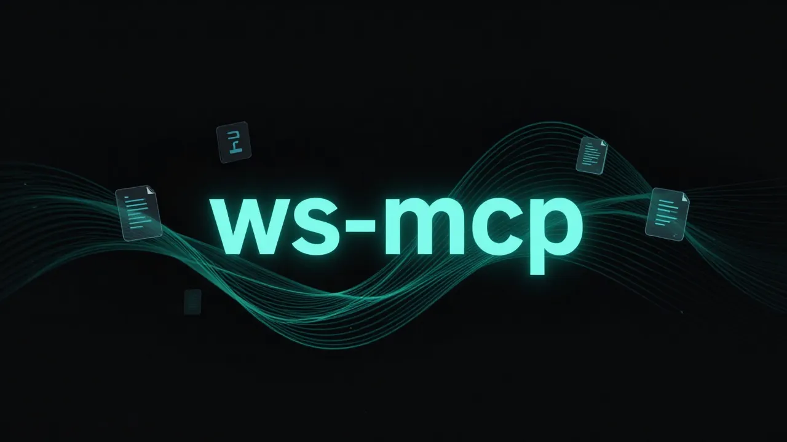

<p align="center">
  
</p>

<h1 align="center">ws-mcp</h1>

<p align="center">
  Self-hosted MCP server that fetches live documentation from official sources.<br/>
  A Context7 alternative — with no rate limits, 230+ libraries, and a code audit tool.
</p>

<p align="center">
  <a href="https://www.npmjs.com/package/ws-mcp"></a>
  <a href="./LICENSE"></a>
  
  
</p>

---

## Why I built this

I use Claude Code daily for production work — Next.js, Supabase, Drizzle, Tailwind, the usual stack. The problem I kept running into: **Claude's training data is always months behind the libraries I'm using.**

When I asked about Next.js 16's `proxy.ts`, it described `middleware.ts`. When I asked about AI SDK v6's `useChat`, it gave me the v5 API. When I needed current Drizzle ORM patterns, it gave me deprecated syntax. The knowledge cutoff isn't a minor inconvenience — for fast-moving libraries it's the difference between code that ships and code that breaks.

The obvious fix is [Context7](https://context7.com), an MCP server that fetches current docs. I used it for months. Then I started hitting rate limits during long sessions. Then I noticed it had around 130 libraries. Then I looked more closely and saw it was returning chunked embeddings of old doc pages rather than the structured content library authors actually publish.

So I built ws-mcp as a Context7 alternative that runs on your own machine.

Key differences:
- **No rate limits** — it runs locally, no shared infrastructure
- **llms.txt first** — library authors write these specifically for AI. Context7 doesn't prioritize them.
- **230+ curated libraries** — plus npm/PyPI fallback for anything not in the registry
- **Code audit tool** — scans your actual files for issues with file paths and line numbers, then fetches live fixes. Context7 has nothing like this.
- **Freeform search** — OWASP, WCAG, MDN, web standards. Not just library docs.

---

## Install

### Claude Code

```bash
claude mcp add ws -- npx -y @senorit/ws-mcp@latest
```

### Cursor / Claude Desktop / VS Code

Add to your MCP config (`claude_desktop_config.json`, `.cursor/mcp.json`, or `.vscode/mcp.json`):

```json
{
  "mcpServers": {
    "ws": {
      "command": "npx",
      "args": ["-y", "@senorit/ws-mcp@latest"]
    }
  }
}
```

No build step. No global install required. Node.js 20+ is the only dependency.

---

## How it works

When you tell your AI client to "use ws for drizzle" or call any `ws_*` tool directly, here's what happens under the hood:

```
1. ws_resolve_library("drizzle")
       │
       ├─ Check internal registry (230+ curated entries)
       │   → matches drizzle-orm
       │   → returns id, docsUrl, llmsTxtUrl, githubUrl
       │
2. ws_get_docs / ws_best_practices
       │
       ├─ Step 1: fetch https://orm.drizzle.team/llms.txt
       │          (written by the library authors for AI assistants — highest signal)
       │
       ├─ Step 2: fetch https://orm.drizzle.team/llms-full.txt
       │          (extended version when available)
       │
       ├─ Step 3: fetch via Jina Reader (https://r.jina.ai/...)
       │          (renders JS-heavy doc pages to clean text)
       │
       └─ Step 4: fetch GitHub README + latest release notes
                  (always works, catches anything else)
       │
3. Content returned to your AI client
       → Answers based on current, official documentation
```

For libraries not in the registry, the server falls back to npm or PyPI to find the homepage, then runs the same 4-step chain. It works for any package — the curated list just makes the first step faster.

Everything runs on stdio transport. No data leaves your machine except the outbound fetch requests to official docs sites.

---

## Tools

### `ws_resolve_library`

Maps a library name to its registry entry. Call this first when you know what you're looking for.

```
"use ws for nextjs"         → vercel/next.js
"use ws for drizzle orm"    → drizzle-team/drizzle-orm
"use ws for fastapi"        → tiangolo/fastapi (PyPI fallback)
"use ws for some-new-lib"   → resolved via npm registry
```

### `ws_get_docs`

Fetches current documentation for a specific topic within a library.

```
ws_get_docs({ libraryId: "vercel/next.js", topic: "caching" })
ws_get_docs({ libraryId: "facebook/react", topic: "server components" })
ws_get_docs({ libraryId: "tailwindcss/tailwindcss", topic: "dark mode" })
```

### `ws_best_practices`

Fetches patterns, anti-patterns, and configuration guidance. Run this before starting anything non-trivial.

```
ws_best_practices({ libraryId: "vercel/next.js" })
ws_best_practices({ libraryId: "supabase/supabase", topic: "row level security" })
ws_best_practices({ libraryId: "drizzle-team/drizzle-orm", topic: "migrations" })
```

### `ws_auto_scan`

Reads your `package.json`, `requirements.txt`, `Cargo.toml`, or `go.mod` and fetches best practices for every dependency automatically. Useful at the start of a session on an unfamiliar codebase.

```
ws_auto_scan({})
ws_auto_scan({ projectPath: "/path/to/project" })
```

### `ws_search`

Searches across web standards, security, accessibility, and performance topics. No library name needed.

```
ws_search({ query: "OWASP SQL injection prevention 2026" })
ws_search({ query: "WCAG 2.2 focus indicators" })
ws_search({ query: "Core Web Vitals LCP optimization" })
ws_search({ query: "JWT vs session cookies security" })
```

Sources: MDN, OWASP, web.dev, W3C, WCAG, Node.js docs, and more. Falls back to DuckDuckGo for anything outside those categories.

### `ws_audit`

Scans your actual source files for real issues — not hypothetical ones. Returns file paths with line numbers and fetches live fixes from official docs.

```
ws_audit({ projectPath: "." })
ws_audit({ projectPath: ".", categories: ["security", "accessibility"] })
```

| Category | What it checks |
|---|---|
| `layout` | Layout shifts, missing image dimensions, CLS |
| `performance` | Bundle size, lazy loading, resource hints, render-blocking |
| `accessibility` | Missing alt text, unlabelled inputs, ARIA misuse |
| `security` | Hardcoded secrets, unsafe innerHTML, CORS misconfiguration |
| `react` | Missing keys, stale closures, effect cleanup |
| `nextjs` | Deprecated APIs, sync request access, missing Suspense boundaries |
| `typescript` | `any` usage, non-null assertions, missing return types |
| `all` | Everything above (default) |

This is the feature that has no equivalent in Context7 or any other docs MCP.

---

## vs. Context7

ws-mcp is a direct Context7 alternative. Here's how they compare:

| | ws-mcp | Context7 |
|---|---|---|
| Hosting | Your machine | Cloud service |
| Rate limits | None | Yes (shared infrastructure) |
| Source priority | llms.txt → Jina → GitHub | Embeddings of docs pages |
| Code audit tool | Yes — file:line + live fixes | No |
| Freeform search | Yes — OWASP, MDN, standards | Library docs only |
| Libraries | 230+ curated + npm/PyPI fallback | ~130 |
| Python / Rust / Go | Yes | Limited |
| API key required | No | No |
| Offline | No (fetches live) | No |

Context7 is a well-built project. ws-mcp takes a different approach: self-hosted, source-priority that follows what library authors actually publish for AI, and an audit tool for real codebases.

---

## Auto-updates

The install command uses `npx -y @senorit/ws-mcp@latest`. Every time your AI client starts a session, npx checks npm for the latest version. If there's a newer release, it downloads and runs it. If the cached version is current, it starts from cache instantly.

When I publish an update — new libraries in the registry, new tools, bug fixes — every user gets it on their next session. No manual steps, no notifications, no opt-in required.

---

## Requirements

- Node.js 20+
- Claude Code, Cursor, VS Code (with MCP extension), or Claude Desktop

---

## Contributing

The library registry lives in `src/sources/registry.ts`. If you want to add a library, open a PR with the entry: `id`, `name`, `docsUrl`, and `llmsTxtUrl` if the project publishes one.

Bug reports and tool suggestions are welcome via [GitHub Issues](https://github.com/rm-rf-prod/ws-mcp/issues).

---

## License

MIT. Free to use, modify, and distribute — including commercially. See [LICENSE](./LICENSE) for the full text.

Built by [Senorit](https://senorit.de).
